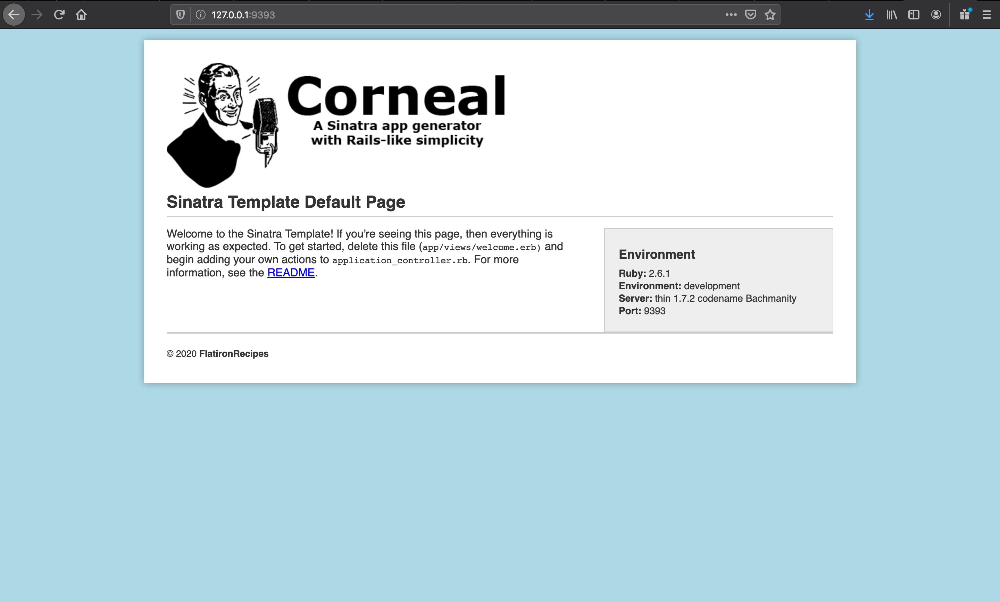
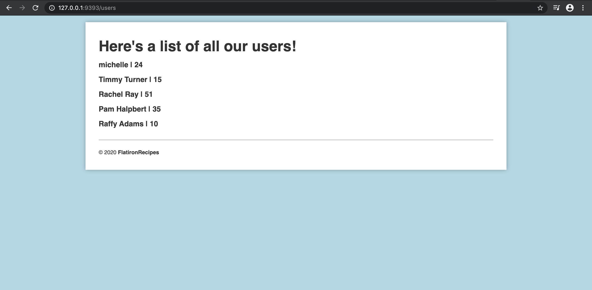

# Intro to Sinatra


#### By the end of this lessons, students will be able to:
1. Explain the MVC pattern and give an example
2. Explain how web frameworks (like Sinatra) use the MVC pattern and why
3. Define 'convention over configuration'
4. Implement one model that inherits from ActiveRecord
5. Implement one controller to route and process requests
6. Implement ERB template and get it to render data from controller and model
    - Practice file structure in Sinatra
7. Identify the connection between REST and CRUD

### Review

- TCP => defines how computers send packets of data to each other

- HTTP => defines how messages are formatted and transmitted, and what actions Web servers and browsers should take in response to various commands

- HTML => defines the standard markup language for creating web pages and web applications

- IP => the principal communications protocol in the Internet protocol suite for relaying datagrams across network boundaries; aka: defines the format of your "internet address"

- TCP/IP => See above! It's the how to send + where to send.


## MVC

MVC is a design pattern that separates the code into three interconnected parts - model, view, controller. MVC adheres to the separation of concerns principles!

<details>
<summary>Model</summary>
<pre>
classes, data/behavior for objects, the database
</pre>
</details>

<details>
<summary>View</summary>
<pre>
what the user sees, frontend, HTML, how the user interacts with the app
</pre>
</details>

<details>
<summary>Controller</summary>
<pre>
logic for handling requests, the middle man between the model and the view
</pre>
</details>


The model represents the data and does nothing else. The model does NOT depend on the controller or the view. The view displays the data through the controller and sends user actions (e.g. button clicks) to the controller. The view is independent of both the model and the controller. The controller provides model data to the view, and interprets user actions such as button clicks. The controller depends on the view and the model.

When the user goes to their browser and types something in, a request is made. The controller in Sinatra will be the entry point for those requests, so it will handle those requests and figure out what logic to run.

MVC is just one of the many common programming architectural paradigms. It's like political parties: most everyone has one and sticks to it, but none have the perfect solution in all cases. However, in the case of Sinatra & Rails, the convention is to use MVC.

<details>
<summary>Why MVC?</summary>
<pre>
<ul>
<li>Maintainable: more organized, easier to debug, easier for developers to navigate</li>
<li>Separation of Concerns: each piece of the app has only one job</li>
</ul>
</pre>
</details>


##### [MVC/REST Slides](https://docs.google.com/presentation/d/1JPFptR3Cn9-mw6nuPcoxDDJ6yBaDmS3VfoBM3rKyjgs/edit#slide=id.g378a2b8862_0_22)

## Convention over configuration

MVC is a convention that we're following. The idea of convention over configuration is that if we bind to a certain way of writing code, the framework that we're using can assume that we are following this certain pattern and make our lives easier.

There's agreed upon conventions in web development and in individual development tools that programmers adhere to in order to make their lives easier. For example, when sending a request we expect that a 200 status code will be returned if the response was successful. We didn't have to configure Sinatra to return a 200 status code meaning that it was successful since it already know and it's already an agreed upon convention and is set to handle that. 

## [RESTful Routing](http://www.restular.com/)

REST stands for *REpresentational State Transfer*. 
  - State -> a snapshot of a piece of the application
  - Representational -> how the user sees our application state
  - Transfer -> how they get it from us

REST is a pattern or a convention to set up what routes we want to have in our app in order to represent the state of our application. More formally, REST is a way to structure client-server communication over HTTP.  

Each route specifically maps to a particular resource/model and can also represent a "method" being passed to that resource's controller. This allows each action on each resource to be unique. Just like CRUD offers both structure and consistency through its rules, REST does the same. By following a "RESTful" pattern, developers have a uniform way of writing their routes. Moreover, REST methods try their best to minimize the number of URLs, but maximizing functionality.

<details>
<summary>What are the HTTP verbs?</summary>
<pre>
GET, POST, PUT/PATCH, DELETE
</pre>
</details>

<details>
<summary>How do the HTTP verbs map to CRUD?</summary>
<pre>
POST -> Create
GET -> Read
PUT/PATCH -> Update
DELETE -> Delete
</pre>
</details>


Let's say we wanted to make a recipe app with a recipe as one of our resources/models and we're using RESTful routes.

1. We want the user to be able to view a page that displays all the receipes.
2. We want the user to be able to get to a page that displays a form to make a new recipe.
3. We want the user to be able to make a new recipe. 
4. We want the user to be able to view a page that displays all the info for one specific recipe. 
5. We want the user to be able to view a page that displays a form to edit a specific recipe
6. We want the user to be able to edit and update an existing recipe. 
7. We want the user to be able to delete a recipe.


|       | Route Name | Path/URI          | HTTP Verb |              Purpose              |
| :---: | :--------: | :---------------- | :-------: | :-------------------------------: |
|  1.   |   Index    | /recipes          |    GET    |         List all recipes          |
|  2.   |    New     | /recipes/new      |    GET    |       Show new recipe form        |
|  3.   |   Create   | /recipes          |   POST    |        Create a new recipe        |
|  4.   |    Show    | /recipes/:id      |    GET    | Show info for one specific recipe |
|  5.   |    Edit    | /recipes/:id/edit |    GET    |   Show edit form for one recipe   |
|  6.   |   Update   | /recipes/:id      |    PUT    |     Update a specific recipe      |
|  7.   |  Destroy   | /recipes/:id      |  DELETE   |     Delete a specific recipe      |


By following the pattern above, we can have a RESTful app with full ability for the user to create recipes, read recipes, update recipes, and delete recipes!


## Let's use Sinatra!


Rack can be messy; It gives people a lot of flexibility, but at the expense of time. Since we're here to learn higher-order concepts, wasting time on configuration prevents us from drilling into those. Sinatra has the added benefit of giving us convention on modularizing our code, which has an immense long-term impact to productivity.

We're going to start creating a Recipe Book app where a user can keep track of their recipes! There's different concepts that we have to cover throughout this project, so building up this up is going to take us the next few lectures.

- Domain: Recipe Book
- Relationships: User -< Recipes
- App Name: Flatiron Recipes

#### Deliverables
For each deliverable, what is the route? What CRUD action does is correspond to?

- View information on an individual user
- View all users
- Create a new user
- Edit an existing user
- Delete an existing user 

#### Setting up project template

To set up a new Sinatra project from scratch, I recommend using the [Corneal Gem](https://github.com/thebrianemory/corneal). It'll create the scaffolding of your Sinatra app for you using `corneal new project-name`. (*Fun fact: this gem was created by a former Flatiron student!*) 

Like we saw in mod 1, we have a db directory where we will have our seed and migration files. We will be doing most of our development work inside of the `app` directory in which you can see three directories correlating to MVC!

#### Controllers & Views

Our **controllers** are the entry point to our applciation in Sinatra. We define the routes that our application will respond to there. If you look inside our application_controller.rb file upon creating the project using corneal, you'll see the following code:
```Ruby
require './config/environment'

class ApplicationController < Sinatra::Base

  configure do
    set :public_folder, 'public'
    set :views, 'app/views'
  end

  get "/" do
    erb :welcome
  end

end
```
If you try executing the command `shotgun` and opening up to `127.0.0.1:9393` in your browser, you should see a Sinatra default Sinatra template page as shown in the picture below.



We didn't really write any code ourselves yet, but this page is certainly coming from somewhere.
<p>
<details>
<summary> Where is this page coming from and how is it being rendered?</summary>
<p>
Well, when we entered <code>127.0.0.1:9393</code> into our browser, our browser sent a request to our server and asked to fetch <code>127.0.0.1:9393/</code>. The controller picked up the request and matched it with the appropriate route, which in this case was our <code>get "/"</code> route. This route told the server to send back an erb file called welcome.
</p>
</details>
</p>
<p>
<p>

If you look inside the `welcome.erb` file inside of `app/views`, there isn't any specification for a CSS file and the structure of the HTML doesn't fully match the structure of the HTML on the browser page, so where did all the structure and styling that we see come from?! Well, we have another file in our **views** called `layout.erb` that the erb files that we write use as a sort of wrapper. Our erb files are rendered where we see `<%= yield %=>`.

<p>
<details>
<summary> Why is <code>layout.erb</code> useful?</summary>
<pre>
It allows us to have a consistent layout across our webpage and it reduces code redundancy. It allows saves time because if we need to make a change to our layout, we only have to make changes in one file instead of to all the files. Another perk of following conventions!
</pre>
</details>
</p>
<p>
<p>

#### Setting up models & migrations using Active Record

So now we want to create a database to store our data using ActiveRecord. We can start off by creating ruby files for the models that we want to represent in our project. In our app's case, we want to keep track of users and recipes, so let's start by creating the `user.rb` file inside of our **models** directory and write the class template code. Don't forget to inherit `ActiveRecord::Base`.

Next, we need migrations. 
<p>
<details>
<summary>How would we use the <code>rake</code> command to create the migration for users?</summary>
<pre><code>
rake db:create_migration NAME=create_users
</code></pre>
</details>
</p>
<p>
<p>

After we create the migration, we should see a new file created inside our `db/migrate` directory.
<p>
<details>
<summary>In the respective migration file for our users, how can we write the instructions to create a table with certain attributes for our users table?</summary>
<pre><code>
class CreateUsers < ActiveRecord::Migration
  def change
    create_table :users do |t|
      t.string :name
      t.integer :age
      t.boolean :coffee_lover
      t.string :occupation
    end
  end
end
</code></pre>
</details>
</p>
<p>
<p>

Great! After this is done, we want to actually create the table in the database, so we need to migrate! We run `rake db:migrate` and then we should check `db/migrate/schema.rb` to verify that the expected table was created successfully.

#### Creating seeds
Let's create a rake console by creating a rake task inside of our `Rakefile` in order to create some seeds for our app. 
```
desc "Console!"
task :console do
  Pry.start
end 
```
By running `rake console`, it'll run our task above, which will start a pry session that has access to all of our application. We can go ahead and start creating some dummy data inside of this pry session using the `User.create` method.
```Ruby
User.create(name:"Rachel Ray", age:51, coffee_lover: true, occupation: "Chef")

User.create(name:"Pam Halpbert", age: 35, coffee_lover: true, occupation: "Salesperson")

User.create(name:"Timmy Turner", age: 15, coffee_lover: false, occupation: "Student")

User.create(name:"Raffy Adams", age:10, coffee_lover: false, occupation: "Babysitter")
```


#### Creating Routes

So at this point, we have gone through our models, views, and controllers. We have the database table set up for users and we added some fake data work with. 

Next, let's define some tasks we want to complete.
  1. Application should be able to show a list of all the users
  2. Application should be able to show the details for ONE specific user

  Whenever we want to add a new view to show the user or a new way of representing our app's state, we need to create a new route. 
<p>
<details>
<summary>If a person viewing our website wants to see all the users with an account on our app, which HTTP method and route would make sense for our app to use according to REST? Or another way to think of it, what sort of request is the person making to our server and what URL or path would we want the person to see? You can view the chart earlier in this document for a hint.</summary>
<pre><code>
Method: GET
Route: /users
</code></pre>
</details>
</p>
<p>
<p>

If our server is running and we type in `127.0.0.1:9393/users` into the browser, you will notice that we get an error page saying `Sinatra doesn't know this ditty`. We haven't handled this route yet, but this error page actually tells us how we may fix this error, so we can go ahead and try it! 
```Ruby
# in app/controllers/application_controller.rb
class ApplicationController
  get '/users' do
    "Hello World"
  end
end
```
Upon following Sinatra's suggestion, we can reload the `127.0.0.1:9393/users` page and we no longer get a `404` page or error! To complete task 1, we want to respond to the browser with a page listing of all the users instead of a page showing `Hello World`. Our controller can interact with our models to get the data it needs, so like in mod 1, we can simply ask for all of the `User` instances in our table. Our controller is then expected to get the appropriate view files and send the data to it for the browser to display. We can create a `users.erb` file inside of our `views` directory. After creating it, I recommend trying to send the erb file first to make sure it loads properly before even worrying about sending the data from the model with it.
```Ruby
# in app/controllers/application_controller.rb

class ApplicationController
  get '/users' do
    # getting data from model
    users = Users.all

    # respond
    erb :users
  end
end

```

If we want to pass variables down from the controller to the views, we need to use instance variables, so our `get /users` route code would look like this:
```Ruby
# in app/controllers/application_controller.rb

class ApplicationController
  get '/users' do
    # getting data from model
    @users = Users.all

    # respond
    erb :users
  end
end

```

And our `user.erb` file would look like this:

```ERB
<h1>Here's a list of all our users!</h1>
 
 <% @users.each do |user| %>

 <h3><%= user.name %> | <%= user.age %></h3>

 <% end %>
```

Notice the Ruby code inside of the `<% %>` and `<%= %>`tags. These tags allow us to write ruby code along HTML. Hence, the erb (embedded ruby) file type! We use `<%= %>` when we want to evaluate Ruby code and print it out to the screen. We typically use `<% %>` when we're doing conditional logic or looping.




##### Other useful info

* `<% %>` - erb tag sometimes referred to as ice cream cones
* `<%= >` - erb tag sometimes referred to as a squid

___

## Cheat Sheet - Steps to creating a Sinatra app with ActiveRecord
1. Set up project
    - Can use `corneal` if starting from scratch
    - `cd` into project
    - `bundle install`
2. Set up model/s (with ActiveRecord)
  - These go inside the `app/models` directory
  - Don't forget your classes need to inherit `< ActiveRecord::Base`
3. Create migrations
  - `rake db:create_migration NAME=create_entity_name_here`
  - entity name should be plural
4. Migrate
  - `rake db:migrate`
  - Migrate files will appear in `db/migrate` directory
5. Create seeds
  - in pry session, `User.create(attribute1: value1, attribute2: value2)`
  - using `seeds.rb`
6. Create routes in Controller
  - Think about what your app needs to accomplish
  - Refer to the REST table


#### Useful commands
* `shotgun` - use to run server
* `rake -T` - view tasks available with rake


___

##### Extra Resources

* [Restular](http://www.restular.com/)
* [Corneal Gem](https://github.com/thebrianemory/corneal)
* [Which ERB tag should I use?](https://medium.com/swlh/cheatsheet-which-erb-tag-should-i-use-4b3de261f15f)
